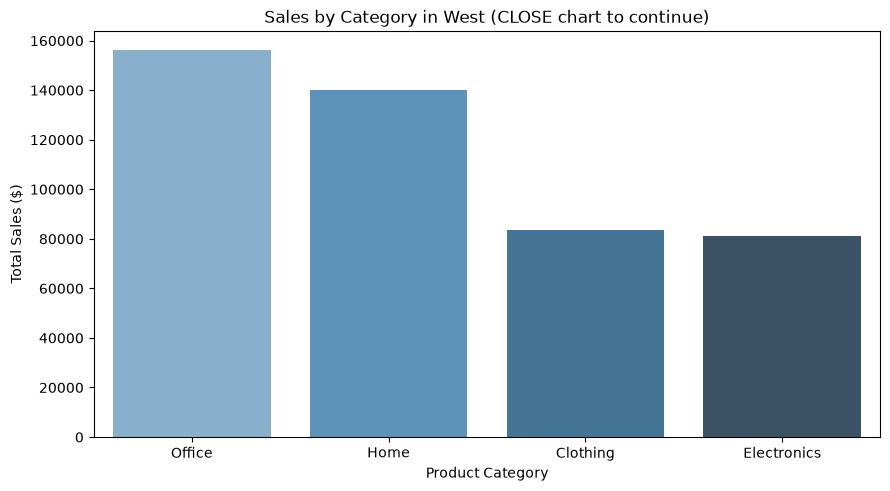
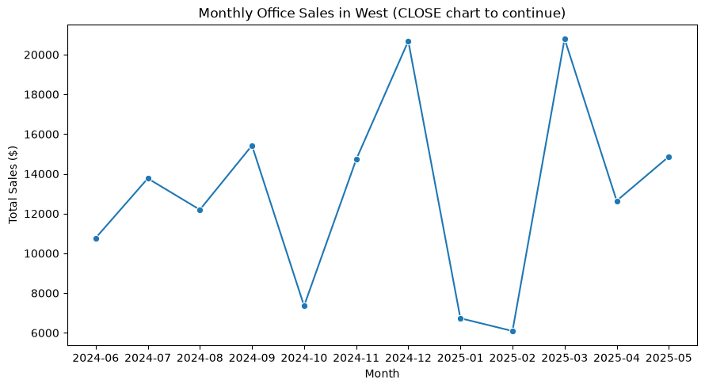

# bintel-06-storytelling

[](https://denisecase.github.io/pro-analytics-02/workflow-b-apply-example-project/)
[](./pyproject.toml)
[](./LICENSE)

> Professional Python project: BI storytelling with smart sales data.

## Project Description

This project focuses on addressing one specific business goal
end to end and telling a story with data.

We learn to:

- define a clear business question and KPI (key performance indicator)
- use reporting-ready data to answer the business question
- summarize and analyze the relevant data
- create connected charts that support the findings
- identify meaningful business insights
- write a clear, actionable business recommendation
- tell a story with data

## Working Files

You'll work with these areas:

- **data/reporting** - reporting-ready data generated earlier
- **docs/** - project narrative and documentation
- **src/bizintel/** - the app is an example; run only (copy to a new file for your work)
- **pyproject.toml** - update authorship & links
- **zensical.toml** - update authorship & links

## Instructions (pro-analytics-02)

Follow the
[step-by-step workflow guide](https://denisecase.github.io/pro-analytics-02/workflow-b-apply-example-project/)
to complete:

1. Phase 1. **Start & Run**
2. Phase 2. **Change Authorship**
3. Phase 3. **Read & Understand**
4. Phase 4. **Modify**
5. Phase 5. **Apply**

## Challenges

Challenges are expected.
Sometimes instructions may not quite match your operating system.
When issues occur, share screenshots, error messages, and details about what you tried.
Working through issues is part of implementing professional projects.

## Success

After completing Phase 1. **Start & Run**,
you'll have your own GitHub project,
and running the example module will print out:

```shell
========================
Executed successfully!
========================
```

A new file `project.log` will appear in the root project folder.

## Command Reference

<details>
<summary>Show command reference</summary>

### In a machine terminal (open in your `Repos` folder)

After you get a copy of this repo in your own GitHub account,
open a machine terminal in your `Repos` folder:

```shell
# Replace username with YOUR GitHub username.
git clone https://github.com/brandon112123/bintel-06-storytelling

cd bintel-06-storytelling
code .
```

### In a VS Code terminal

These are listed for convenience.
For best results, follow the detailed instructions in
[pro-analytics-02 guide](https://denisecase.github.io/pro-analytics-02/).

```shell
uv self update
uv python pin 3.14
uv lock --upgrade
uv sync --extra dev --extra docs --upgrade

uvx pre-commit install
uvx pre-commit autoupdate

git add -A
uvx pre-commit run --all-files
# repeat if changes were made
uvx pre-commit run --all-files

# OPTIONAL: run the example module
uv run python -m bizintel.app_case

# TASK 1: run the example storytelling module for an example problem
uv run python -m bizintel.storytelling_case

# TASK 2: run your own storytelling module that looks at a different problem
# add your command in the line below
uv run python -m bizintel.storytelling_smith


# run common chores
uv run ruff format .
uv run ruff check . --fix
uv run python -m pyright
uv run python -m pytest
uv run python -m zensical build

# save progress
git add -A
git commit -m "update"
git push -u origin main
```

</details>

## Notes

- Use the **UP ARROW** and **DOWN ARROW** in the terminal to scroll through past commands.
- Use `CTRL+f` to find (and replace) text within a file.
- You do not need to add to or modify `tests/`. They are provided for example only.
- Many files are silent helpers. Explore as you like, but nothing is required.
- You do NOT need to understand everything; understanding builds naturally over time.

## Troubleshooting >>>

If you see something like this in your terminal: `>>>` or `...`
You accidentally started Python interactive mode.
It happens.
Press `Ctrl+c` (both keys together) or `Ctrl+Z` then `Enter` on Windows.

## Modified Project Output

For my technical modification, I changed the selected region from East to West.
The project still found Office as the leading category, but the sales results
changed based on the West region.

```shell
| BI | Summarizing category sales for Region = 'West'
| BI |   Categories summarized: 4
| BI |   Selected leading category for deeper analysis: Office
| BI | Summarizing monthly sales for Region = 'West'
| BI | Summarizing monthly sales for Category = 'Office'
| BI |   Months summarized: 12
| BI | Creating chart: Sales by Category in West
| BI | Creating chart: Monthly Office Sales in West
| BI | Identifying key results
| BI |   Selected region: West
| BI |   Leading category: Office
| BI |   Leading category sales: $156,047.48
| BI |   Strongest month: 2025-03
| BI |   Strongest month sales: $20,794.91
| BI | ========================
| BI | Executed successfully!
| BI | ========================
```

## Findings and Visuals

The West region had Office as its leading product category with
$156,047.48 in total sales. March 2025 was the strongest month for
Office sales with $20,794.91.

### Sales by Category in the West



### Monthly Office Sales in the West



## Findings and Visuals

Take screenshots of your charts and provide them here with a discussion.
In Markdown, display a figure using:
an exclamation mark immediately followed by square brackets containing a useful caption
immediately followed by parentheses containing the relative path to your figure.

In your custom project:

- your figures and narrative should reflect your work
- this `README.md` should include your commands, process, and visuals
- `docs/index.md` should include your narrative

Replace these placeholders with screenshots from your own project run:


## Project Documentation

Additional project instructions, terms, and notes:

[docs/index.md](docs/index.md)

## Citation

[CITATION.cff](./CITATION.cff)

## License

[MIT](./LICENSE)
