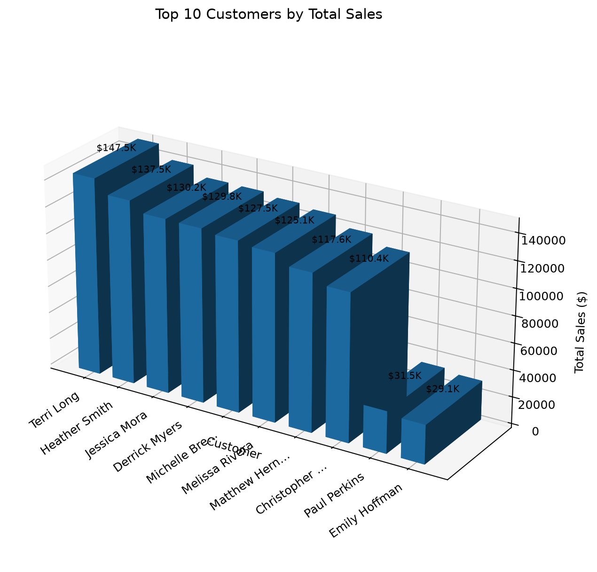
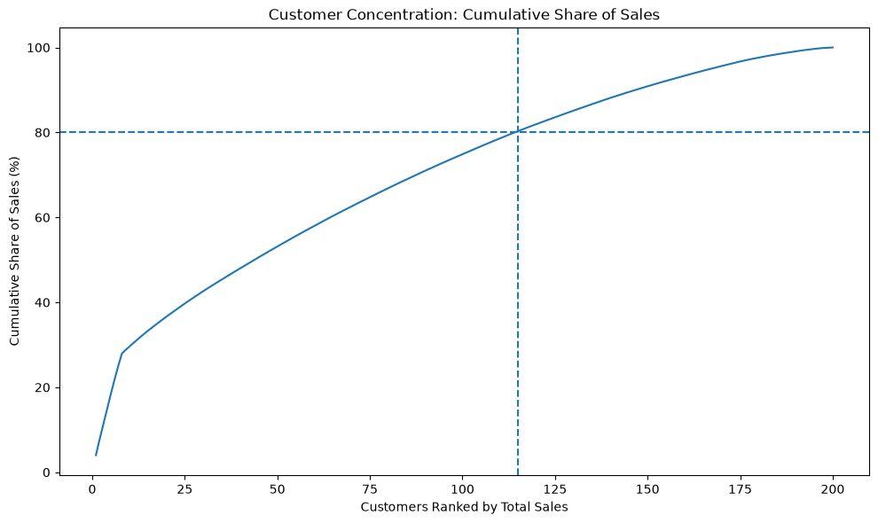

# Project Documentation

This site provides project documentation.
Use the documentation navigation to explore.

## How-To Guide

Many instructions are common to all our projects.

See
[⭐ **Workflow: Apply Example**](https://denisecase.github.io/pro-analytics-02/workflow-b-apply-example-project/)
to get the example projects running on your machine.

## Project Documentation Pages (docs/)

- **Home** - this documentation landing page
- [**Project Instructions**](./project-instructions.md) - the standard project workflow
- [**Your Files**](./your-files.md) - how to copy the example and create your version
- [**Glossary**](./glossary.md) - project terms and concepts
- [**API**](./api.md) - autogenerated code documentation for the public project interface

## Example Storytelling Question

The example project answers this business question:

> Which product category contributes the most sales in the selected region,
> and when are its sales strongest?

The example follows a general BI storytelling process:

1. Define one clear business question.
2. Identify the data needed to answer it.
3. Summarize the data.
4. Create charts that provide evidence.
5. Identify the most important results.
6. Explain the findings in your documentation.
7. Recommend an action or next question.

Your project should follow the same general process,
but answer a different business question.

## Phase 4. Technical Modification

For my technical modification, I copied `storytelling_case.py` and created
`storytelling_smith.py`. I changed the selected region from East to West and
changed the chart output names so they would not overwrite the original charts.

I chose this change because I wanted to see how the results would change when
looking at a different region.

After running the modified project, Office was still the leading category in
the West with $156,047.48 in sales. March 2025 was the strongest month with
$20,794.91 in Office sales.

### Sales by Category in the West

### Monthly Office Sales in the West

This was an easy change because the project already had a setting for the
selected region. I only had to change the region and update the output file
names.

## Phase 5. Custom Project

### Basis and Problem

I used the reporting-ready sales data to look at how much each customer
contributed to total sales.

I used CustomerID, CustomerName, TransactionID, and SaleAmount because these
columns helped me group sales by customer and calculate total sales.

One limitation is that the data shows how much customers spent, but not why
they spent more or less.

### Business Question

> How concentrated are total sales among customers, and how many customers
> generate 80% of company revenue?

This matters because the business should know if most sales come from only a
few customers or from a larger customer base.

### Analysis Approach

I grouped the data by customer, added up total sales, and ranked the customers
from highest to lowest.

The first chart shows the top 10 customers by total sales. The second chart
shows how many customers are needed to reach 80% of total sales.

### Charts and Evidence

#### Top 10 Customers by Total Sales

Terri Long was the top customer with about $147,500 in total sales.

#### Customer Concentration

About 115 out of 200 customers were needed to generate 80% of total sales.

### Findings and Recommendation

Sales are spread across a large part of the customer base instead of depending
on only a few customers.

I would focus on keeping the highest-spending customers while also finding ways
to increase sales from other customers.

A good next step would be to look at what products the highest-value customers
are buying.

### Storytelling Summary

This project looked at how sales were spread across customers.

Terri Long was the top customer with about $147,500 in sales, and about 115 of
the 200 customers were needed to generate 80% of total sales.

The results show that the company depends on a fairly large part of its customer
base instead of only a few customers. This type of analysis could help with
customer retention and promotion decisions.
